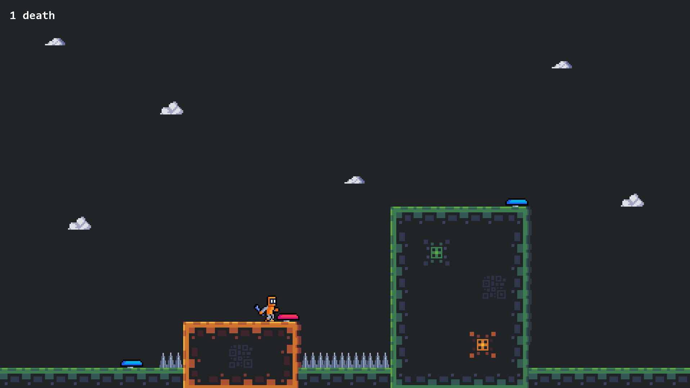

# GameJam Epitech 2020-1

This game has been created for the first epitech jam of 2020 with the theme `only two buttons`. It was made on GameMakerStudio by Hugo Boichard, Dorian You and Benjamin Raymond.

:warning: This game is not finished because we had to interrupt the game jam because of the emergency departure of Berlin due to covid-19 and the first quarantines.

## Game rules

In this game, you don't control the character like in a classic 2D platformer, but you control objects on the level that affect the character. It is up to you to activate these objects at the right time to allow your character to finish the different levels.

## Controls

You can trigger the blue objects with the key `A` and the red objects with the key `E`.
